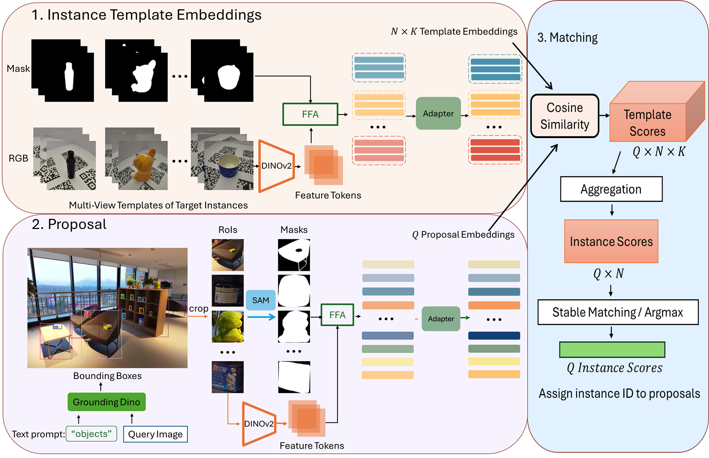
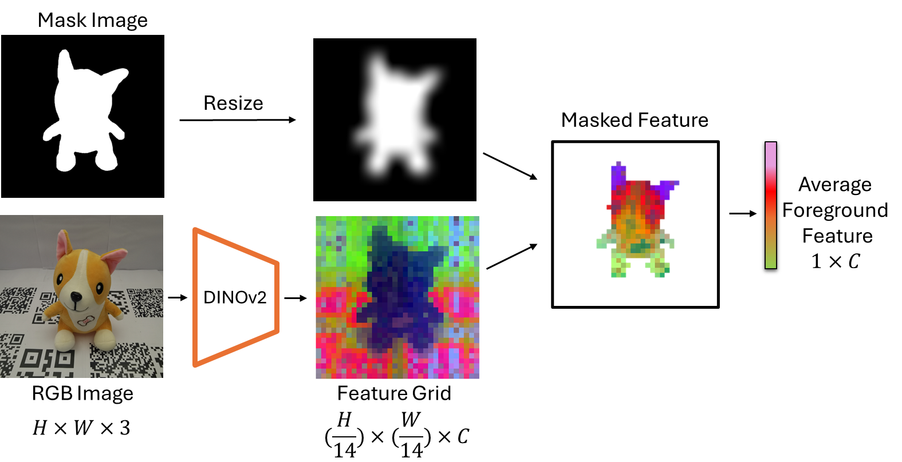
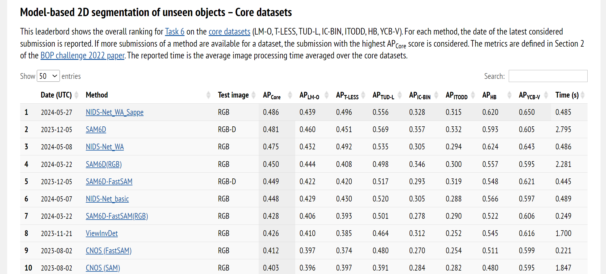

# NIDS-Net
A unified framework for Novel Instance Detection and Segmentation (NIDS).

The basic NIDS-Net **does not require any training** since it does not involve adapters!  It works for one-shot or few-shot detection and segmentation tasks.

Training the adapter is *simple and quick* because it's just a two-layer network. You can train the adapter in just a few minutes, even with hundreds of epochs!

[arXiv](https://arxiv.org/abs/2405.17859), [Project](https://irvlutd.github.io/NIDSNet/)

## Adapting Pre-Trained Vision Models for Novel Instance Detection and Segmentation
> Novel Instance Detection and Segmentation (NIDS) aims at detecting and segmenting novel object instances given a few examples of each instance. We propose a unified framework (NIDS-Net) comprising object proposal generation, embedding creation for both instance templates and proposal regions, and embedding matching for instance label assignment. Leveraging recent advancements in large vision methods, we utilize the Grounding DINO and Segment Anything Model (SAM) to obtain object proposals with accurate bounding boxes and masks. Central to our approach is the generation of high-quality instance embeddings. We utilize foreground feature averages of patch embeddings from the DINOv2 ViT backbone, followed by refinement through a weight adapter mechanism that we introduce. We show experimentally that our weight adapter can adjust the embeddings locally within their feature space and effectively limit overfitting. This methodology enables a straightforward matching strategy, resulting in significant performance gains. Our framework surpasses current state-of-the-art methods, demonstrating notable improvements of 22.3, 46.2, 10.3, and 24.0 in average precision (AP) across four detection datasets. In instance segmentation tasks on seven core datasets of the BOP challenge, our method outperforms the top RGB methods by 3.6 AP and remains competitive with the best RGB-D method.

## Framework

## Foreground Feature Averaging (FFA)
[FFA](https://github.com/s-tian/CUTE)  is used to generate the initial embeddings in our framework.


## Detection Example


## BOP Leaderboard
[Ranked #1: Model-based 2D segmentation of unseen objects – Core datasets](https://bop.felk.cvut.cz/leaderboards/segmentation-unseen-bop23/core-datasets/). 


## Segmentation Example


## Getting Started
We prepare demo google colabs: [inference on a high-resolution image](https://colab.research.google.com/drive/1dtlucQ5QryLgooSDkH-Qumxrrnb-9FCg?usp=sharing) and [Training free one-shot detection](https://colab.research.google.com/drive/1IM8TgpNo_9TijopO3PRyZea7MgTUjv30?usp=sharing). 
### Prerequisites
- Python 3.7 or higher (tested 3.9)
- torch (tested 2.0)
- torchvision

### Installation
```sh
git clone https://github.com/YoungSean/NIDS-Net.git
cd NIDS-Net
conda env create -f environment.yml
conda activate nids
conda install pytorch==2.2.1 torchvision==0.17.1 torchaudio==2.2.1 pytorch-cuda=11.8 -c pytorch -c nvidia
conda install xformers -c xformers
python setup.py install
python -m pip install 'git+https://github.com/facebookresearch/detectron2.git'
# for using SAM
pip install git+https://github.com/facebookresearch/segment-anything.git
# Use old supervision. 
pip install supervision==0.20.0 
```
#### Download [ViT-H SAM weights](https://github.com/facebookresearch/segment-anything#model-checkpoints)
```shell
wget https://dl.fbaipublicfiles.com/segment_anything/sam_vit_h_4b8939.pth
```
After installation, there will be a folder named "ckpts". Move the SAM weight to "ckpts/sam_weights/sam_vit_h_4b8939.pth".
```shell
mkdir ckpts/sam_weights
mv sam_vit_h_4b8939.pth ckpts/sam_weights
```

### Preparing Datasets
<details>
<summary> Setting Up 4 Detection Datasets </summary>
We do not need training datasets for detectors. We can use template embeddings to train the adapter.

#### High-resolution Dataset
This [instance-detection repo](https://github.com/insdet/instance-detection) provide the [InsDet-Full](https://drive.google.com/drive/folders/1rIRTtqKJGCTifcqJFSVvFshRb-sB0OzP).
```shell
cd $ROOT
ln -s $HighResolution_DATA database
```
We provide the preprocessed testing images in this [link](https://utdallas.box.com/s/bfcgn0dpbvu5w5be20wyj41fzsjajh4h) accorinding to this [instance-detection](https://github.com/insdet/instance-detection). Please put them into "Data" folder as follows:
```
database
│
└───Background
│
└───Objects
│   │
│   └───000_aveda_shampoo
│   │   │   images
│   │   │   masks
│   │
│   └───001_binder_clips_median
│       │   images
│       │   masks
│       │   ...
│   
│   
└───Data
    │   test_1_all
    │   test_1_easy
    │   test_1_hard
```

#### RoboTools, LM-O and YCB-V
VoxDet provides the [datasets](https://github.com/Jaraxxus-Me/VoxDet).
Save and unzip them in '$ROOT/datasets' to get "datasets/RoboTools", "datasets/lmo", "datasets/ycbv". 
</details>


## Usage
You can directly use the demo google colabs: [inference on a high-resolution image](https://colab.research.google.com/drive/1dtlucQ5QryLgooSDkH-Qumxrrnb-9FCg?usp=sharing) and [Training free one-shot detection](https://colab.research.google.com/drive/1IM8TgpNo_9TijopO3PRyZea7MgTUjv30?usp=sharing).

1. Check GroundingDINO and SAM
- GroundingDINO + SAM: [`test_gdino_sam.py`](test_gdino_sam.py)

2. Generate template embeddings via [get_object_features_via_FFA.py](get_object_features_via_FFA.py).
Or you can download the [template embeddings and model weights for detection datasets](https://utdallas.box.com/s/ieo7lochg1dzzdjfqm7saiudaeptufoi). The initial embedding file name includes "object_features". Model weights use the "pth" suffix. Adapted embeddings are saved as JSON files ending with "vitl_reg.json".

You may adjust their filenames to load them in the python scripts.
```shell
# download the initial template embeddings of 4 detection datasets
mkdir obj_FFA
wget https://utdallas.box.com/shared/static/50a8q7i5hc33rovgyavoiw0utuduno39 -O obj_FFA/object_features_vitl14_reg.json

mkdir BOP_obj_feat
wget https://utdallas.box.com/shared/static/qlyekivfg6svx84xhh5xv39tun3xza1u -O BOP_obj_feat/lmo_object_features.json
wget https://utdallas.box.com/shared/static/keilpt2i2gk0rrjymg0nkf88bdr734wm -O BOP_obj_feat/ycbv_object_features.json
mkdir RoboTools_obj_feat
wget https://utdallas.box.com/shared/static/e7o7fy00qitmbyg51wb6at9vc1igzupb -O RoboTools_obj_feat/object_features.json
mkdir adapted_obj_feats
```
3. Train weight adapters in [adapter.py](adapter.py) (Optional).
You can start with the basic version without the weight adapter.

To train the adapter, prepare the training dataset and set parameters in [adapter.py](adapter.py). 

After training, use the adapter to refine the embeddings and store them in the folder '$ROOT/adapted_obj_feats'. The [adapter.py](adapter.py) script can fine-tune the template embeddings using the trained adapter.

If you do not or forget to convert with adapter.py, you can convert original to adapted template embeddings with 'utils/transform_adapted_feats.py', typically used for BOP datasets. 

To reuse the adapter during inference, enable "use_adapter" and specify the weight adapter weight path in the inference scripts.

Here's how to train the weight adapter for high-resolution data:
```shell
python adapter.py
```
4. Inference 
```sh
# for high-resolution dataset
# demo image
# in each script, there are some parameters you can adjust
# for example, the flag "use_adapter", the adapter type and the adapter weight path in demo_eval_gdino_FFA.py

python demo_eval_gdino_FFA.py

# dataset results
# for high-resolution dataset
python mini_test_eval_gdino_FFA.py
# for lm-o dataset 
python lmo_test_eval_gdino_FFA.py
# since YCB-V and RoboTools have many scenes
# we first get detection prediction results for each scene
./get_ycbv_prediction.sh 
./get_RoboTools_prediction.sh 

# then merge them using utils/merge_COCO_json.py. You can download Ground truth files in the following link.
# evaluate them with eval_result.py
```
We include the ground truth files and our predictions in this [link](https://utdallas.box.com/s/ieo7lochg1dzzdjfqm7saiudaeptufoi). You can run [eval_results.py](eval_results.py) to evaluate them. Ground truth filenames include "gt" or "test", while our prediction filenames include "coco_instances".

Note: Uncomment this line [sel_roi['mask'] = mask](https://github.com/YoungSean/NIDS-Net/blob/main/utils/inference_utils.py#L181) if you need masks in the result.

## BOP Challenge 2023

### Segmentation Datasets

Please follow [CNOS](https://github.com/nv-nguyen/cnos?tab=readme-ov-file#2-datasets-and-model-weights) to download the datasets. Our code is based on [CNOS](https://github.com/nv-nguyen/cnos) and [SAM6D](https://github.com/JiehongLin/SAM-6D).

We mainly use the template images from BlenderProc4BOP set due to its better performance. The dataest is used to generate template embeddings. Please find the template embeddings in this [link](https://utdallas.box.com/s/yw8oazutnp1ektcnzh3hm8u5vjtq7to7). So you can use these template embeddings to train the adapter. 

If you just need template embeddings for matching, you do **not** need to download the BlenderProc4BOP datasets for inference. **Only** testing datasets are needed. 

### Inference on [BOP datasets](https://bop.felk.cvut.cz/datasets/)

Access NIDS-Net's prediction results, template embeddings and the adapter model weight for seven BOP benchmark datasets [here](https://utdallas.box.com/s/yw8oazutnp1ektcnzh3hm8u5vjtq7to7).

Before running the inference, please download the template embeddings and adapter model weight from the link above. You may set [self.use_adapter](https://github.com/YoungSean/NIDS-Net/blob/main/src/model/detector.py#L187) to True and modify the [model weight path](https://github.com/YoungSean/NIDS-Net/blob/main/src/model/detector.py#L195) and [the adapted template embedding path](https://github.com/YoungSean/NIDS-Net/blob/main/src/model/detector.py#L220) in the model file.

1. Train the weight adapter.
You may change the folder path in the following python scripts. These paths are pointing to initial instance template embeddings.
```shell
python obj_adapter.py
# now you train a common adapter for all datasets
# Then you can use the adapter to generate the adapter template embeddings for the BOP datasets
# the following python script will generate the adapter template embeddings.
python transforme_adapter_feats.py
```

2. Run NIDS-Net to get predictions of a BOP dataset:

```
export DATASET_NAME=lmo 
# adding CUDA_VISIBLE_DEVICES=$GPU_IDS if you want to use a specific GPU

# with Grounded-SAM + PBR
python run_inference.py dataset_name=$DATASET_NAME

```
Once the script completes, NIDS-Net will generate a prediction file at this [directory](https://github.com/YoungSean/Novel-Instance-Detection-BOP/blob/840d10ea4954cf9e6e4a77f2a4c49ada005406b6/configs/run_inference.yaml#L10). You can then assess the prediction on the [BOP Challenge website](https://bop.felk.cvut.cz/).

3. Prediction Visualization with Detectron2

Display masks, object IDs, and scores using Detectron2.
```
python -m src.scripts.visualize_detectron2 dataset_name=$DATASET_NAME input_file=$INPUT_FILE output_dir=$OUTPUT_DIR
```

## ROS demo
We test our NIDS-Net on YCBV objects using ROS with a Fetch robot. We use 
1. template embeddings of synthetic images from CNOS: "ros/weight_obj_shuffle2_0501_bs32_epoch_500_adapter_descriptors_pbr.json"
2. The adapter weight: "ros/bop_obj_shuffle_weight_0430_temp_0.05_epoch_500_lr_0.001_bs_32_weights.pth" 

### Youtube Video 
Click the following image ro this [YouTube link](https://youtu.be/4ZrZIOaH6-I?si=rCyGRAvJy2JBa9g7) to watch the video.

[](https://youtu.be/4ZrZIOaH6-I)

### Installation
```shell
# add some packages for ROS
# Assume you are using ROS Noetic
conda install -c conda-forge rospkg empy
source /opt/ros/noetic/setup.bash 
pip install easydict
pip install transforms3d

# test NIDS-Net on a YCBV image
python ros/test_ycb_sample.py
# use the ROS node to test NIDS-Net on YCBV objects
cd ros
# Assume you are using GPU:0.
# This node is publishing the detection results for YCBV objects.
python test_images_segmentation_NIDS_Net.py
```


## Citation
If you find the method useful in your research, please consider citing:
```latex
@misc{lu2024adapting,
      title={Adapting Pre-Trained Vision Models for Novel Instance Detection and Segmentation}, 
      author={Yangxiao Lu and Jishnu Jaykumar P and Yunhui Guo and Nicholas Ruozzi and Yu Xiang},
      year={2024},
      eprint={2405.17859},
      archivePrefix={arXiv},
      primaryClass={cs.CV}
}
```

## Acknowledgments

This project is based on the following repositories:
- [GroundingDINO](https://github.com/IDEA-Research/GroundingDINO)
- [MobileSAM](https://github.com/ChaoningZhang/MobileSAM)
- [CLIP](https://github.com/openai/CLIP)
- [VoxDet](https://github.com/Jaraxxus-Me/VoxDet)
- [InsDet](https://github.com/insdet/instance-detection)
- [SAM](https://github.com/facebookresearch/segment-anything)
- [DINOv2](https://github.com/facebookresearch/dinov2)
- [SAM6D](https://github.com/JiehongLin/SAM-6D)
- [FFA](https://github.com/s-tian/CUTE)
- [CNOS](https://github.com/nv-nguyen/cnos)


